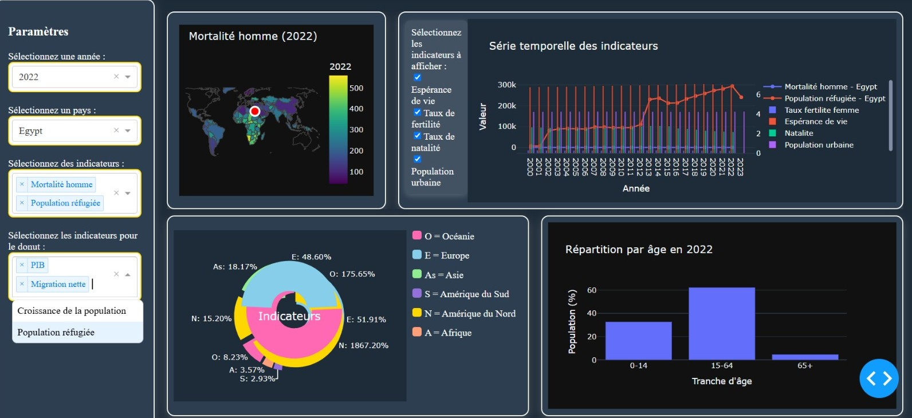

#Rania
#Sirina

# 🌍 World Demographic Trends  

Le **tableau de bord interactif** permet d’explorer les **dynamiques démographiques mondiales** à travers plusieurs visualisations basées sur des données de la **Banque Mondiale**.  

## 🌐 Application en ligne  
Accédez au **tableau de bord en ligne** [ici](https://example.com)  

## 🖼️ Aperçu du tableau de bord  
Voici un aperçu du tableau de bord :  



## 🎯 Objectifs  
Grâce à cet outil, il est possible de :  

✅ **Analyser les tendances démographiques** : suivre l’évolution de la **fertilité**, de l’**espérance de vie** et de la **croissance de la population** à travers différents pays et périodes.  
✅ **Comparer les indicateurs entre pays et continents** : visualiser les **écarts et similitudes** en matière de **migration**, de **répartition par âge** et d’**urbanisation**.  
✅ **Évaluer l’impact des dynamiques démographiques sur la santé publique** : identifier les **défis liés au vieillissement** et aux **systèmes de santé**.

## 🗺️ Graphiques et Sélections Utilisateur  

Découvrez les différentes visualisations disponibles dans le tableau de bord :


| Type de graphique            | Sélection utilisateur                        | Données utilisées                                       | Objectif                                                |
|------------------------------|----------------------------------------------|---------------------------------------------------------|---------------------------------------------------------|
| **Carte Choroplèthe**         | Pays, indicateur, année                      | Tous les indicateurs                                     | Visualisation géographique                               |
| **Série Temporelle**          | Plusieurs pays, plusieurs indicateurs       | Espérance de vie, taux de fertilité, PIB par habitant (USD courants), migration nette | Comparaison d’indicateurs dans le temps                 |
| **Histogramme**               | Plusieurs pays, indicateur                  | Taux de fertilité des femmes, espérance de vie brut      | Comparaison de pays sur un indicateur                   |
| **Diagramme en Barres**       | Pays, année                                 | Population âgée de 0 à 14 ans, population de 15 à 64 ans, population de 65 ans et plus | Répartition par âge                                     |
| **Diagramme en Anneau (Donut Chart)** | Continent, plusieurs indicateurs        | Croissance de la population, PIB par habitant (USD courants), migration nette, population réfugiée | Répartition des indicateurs sélectionnés par continent |


## 🚀 Technologies utilisées  
- **Python** (Dash, Plotly, Pandas)  
- **Données** : Banque Mondiale  
- **Hébergement** : GitHub  

## 📌 Installation et exécution  

```python
# Installer les dépendances nécessaires
pip install dash plotly pandas

# Lancer l'application Dash
python app.py
